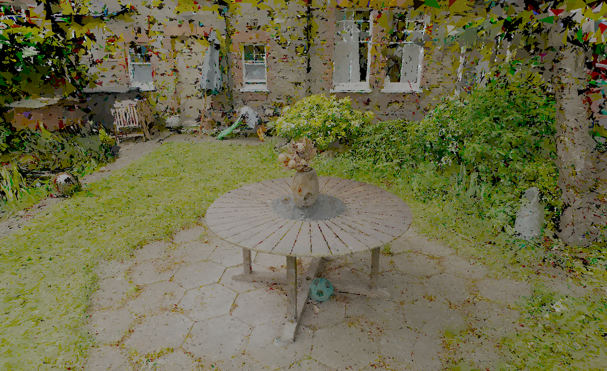

# UnityTriangleSplatting

## Introduction

**UnityTriangleSplatting** is a Unity package for visualizing triangle splats from COFF files, inspired by the [Triangle Splatting](https://github.com/trianglesplatting/triangle-splatting) project. It supports chunked loading, frustum culling, and optional mesh collider generation for interactive exploration of large triangle datasets.

## Features

- Load and render `.off` (COFF) triangle files  
- Chunk-based loading for performance  
- Frustum culling for real-time optimization  
- Optional mesh collider generation  
- Vertex color support for per-vertex shading  

## Example

> 💡 You can drag and drop the TriangleSplatRenderer prefab in your scene and your file will be loaded at runtime.

## Installation

### Option 1: Clone the repository

1. Clone this repository:  
   `git clone https://github.com/KillianCartelier/UnityTriangleSplatting.git`  
2. Open your Unity project.  

### Option 2: Import the Unity package

1. Download the `TriangleSplatUnity.unitypackage` file from the repository.  
2. In Unity, go to `Assets > Import Package > Custom Package...`  
3. Select the downloaded `.unitypackage` file and import all assets.

## Usage

1. Drag and drop the TriangleSplatRenderer prefab in your scene.
2. Set the path to your `.off` file.  
4. Press Play to visualize the triangle splats in the scene.

## Requirements

- Unity 2022.3+ (tested with Unity 6 beta)  
- A COFF file with triangle and color data  

## To-Do

- [ ] Runtime `.off` file loader via UI  
- [ ] Support for mesh Export  

## License

This project is licensed under the MIT License.

## Contributing

Contributions are welcome! Feel free to:  
- Open issues for bugs or suggestions  
- Submit pull requests with improvements  
- Share your use cases and feedback  
